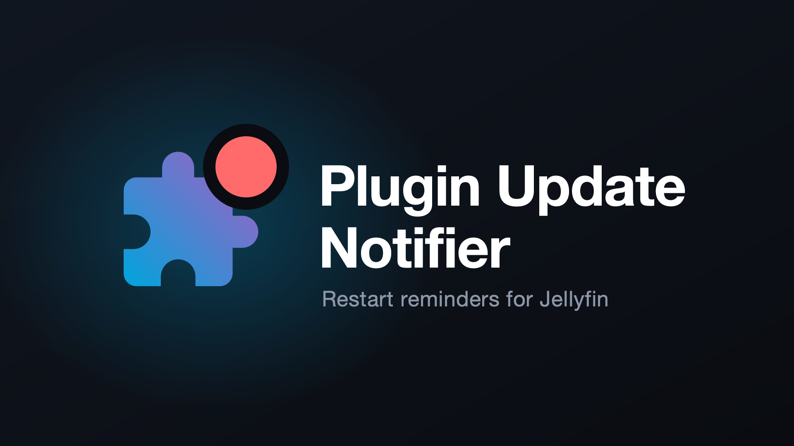
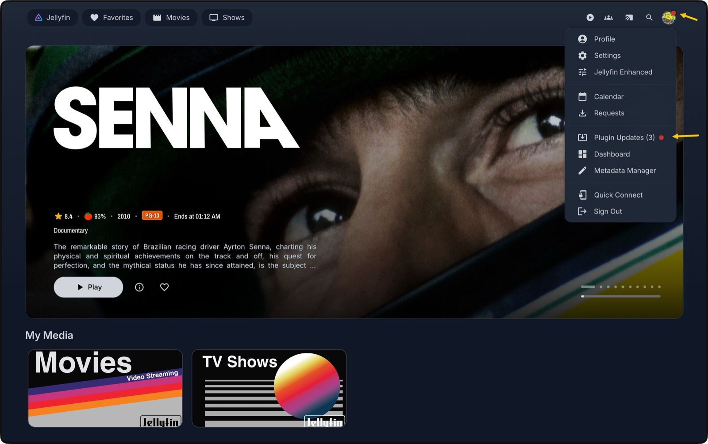

<h1 align="center">Plugin Update Notifier</h1>
<h2 align="center">A Jellyfin Plugin</h2>

<p align="center">
  
</p>

<p align="center">
  Badges the admin avatar and adds a profile-menu entry when plugins have been
  updated and the server needs a restart, with a dashboard page listing what
  changed and each release's changelog.
</p>

<p align="center">
  <a href="https://github.com/mihaif7/jellyfin-plugin-updatenotifier/blob/main/LICENSE"></a>
  <a href="https://github.com/mihaif7/jellyfin-plugin-updatenotifier/releases/latest"></a>
  
  <a href="https://github.com/mihaif7/jellyfin-plugin-updatenotifier/actions/workflows/build.yml"></a>
  
</p>

> [!NOTE]
> **Jellyfin 12 only.** The plugin uses APIs that do not exist in 10.x.

<p align="center">
  
  
</p>

## ✨ Features

- **Avatar badge**: a dot on the admin's profile avatar the moment a plugin change leaves a restart pending.
- **Profile-menu entry**: *Plugin Updates (N)* in the user dropdown, shown only to administrators.
- **Dashboard page**: lists every changed plugin, its old → new version, and the release changelog, themed to match your server.
- **One-click dismiss**: dismissing is shared across every browser and device, not stored per-browser.
- **Self-clearing**: the notice clears automatically on the next restart, since a restart is exactly what it was asking for.

## 🚀 Installation

1. In Jellyfin, open **Dashboard → Plugins → Repositories**.
2. Click **➕** and add the repository:

> [!NOTE]
> ```
> https://raw.githubusercontent.com/mihaif7/jellyfin-plugin-updatenotifier/main/manifest.json
> ```

3. Open the **Catalog** tab, find **Plugin Update Notifier**, and click **Install**.
4. **Restart** your Jellyfin server.

> [!IMPORTANT]
> The **avatar badge and profile-menu entry** additionally require the
> [JavaScript Injector](https://github.com/n00bcodr/Jellyfin-JavaScript-Injector)
> plugin (4.0.0.0 or newer, for Jellyfin 12), which this plugin registers its
> script with automatically. The dashboard page works without it; the plugin
> just logs a warning and skips the badge.

<details>
<summary>Manual installation</summary>

Download the zip from the
[latest release](https://github.com/mihaif7/jellyfin-plugin-updatenotifier/releases/latest),
extract it into `<config>/plugins/Plugin Update Notifier_<version>/`, and restart.
</details>

## 🤝 Contributing

Bug reports and feature requests are welcome via the
[issue tracker](https://github.com/mihaif7/jellyfin-plugin-updatenotifier/issues).
Pull requests that keep within the plugin's scope are happily reviewed.

Build with the .NET 10 SDK:

```sh
dotnet build src -c Release
```

## 📝 License

[GPL-3.0](LICENSE), matching Jellyfin itself.
