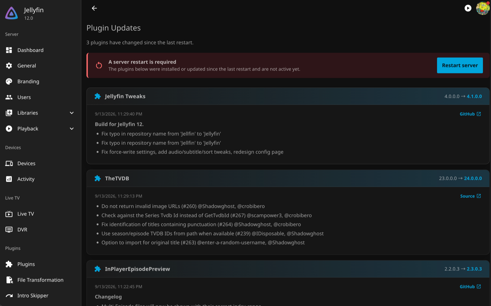

<h1 align="center">Plugin Update Notifier</h1>
<h2 align="center">A Jellyfin Plugin</h2>

<p align="center">
  Badges the admin avatar and adds a profile-menu entry when plugins have been
  updated and the server needs a restart — with a dashboard page listing what
  changed and each release's changelog.
</p>

<p align="center">
  <a href="https://github.com/mihaif7/jellyfin-plugin-updatenotifier/blob/main/LICENSE">
    
  </a>
  <a href="https://github.com/mihaif7/jellyfin-plugin-updatenotifier/releases/latest">
    
  </a>
  
  <a href="https://github.com/mihaif7/jellyfin-plugin-updatenotifier/actions/workflows/build.yml">
    
  </a>
  
</p>

> [!NOTE]
> **Jellyfin 12 only.** The plugin uses APIs that do not exist in 10.x.

<!--
Screenshots — drop the PNGs into docs/screenshots/ and uncomment. Big plugins
lead with a couple of images; you already captured these while testing.

<p align="center">
  
  
</p>
-->

## ✨ Features

- **Avatar badge** — a dot on the admin's profile avatar the moment a plugin change leaves a restart pending.
- **Profile-menu entry** — *Plugin Updates (N)* in the user dropdown, shown only to administrators.
- **Dashboard page** — lists every changed plugin, its old → new version, and the release changelog, themed to match your server.
- **One-click dismiss** — dismissing is shared across every browser and device, not stored per-browser.
- **Self-clearing** — the notice clears automatically on the next restart, since a restart is exactly what it was asking for.

## 🚀 Installation

1. In Jellyfin, open **Dashboard → Plugins → Repositories**.
2. Click **➕** and add the repository:

> [!NOTE]
> ```
> https://raw.githubusercontent.com/mihaif7/jellyfin-plugin-updatenotifier/main/manifest.json
> ```

3. Open the **Catalog** tab, find **Plugin Update Notifier**, and click **Install**.
4. **Restart** your Jellyfin server.

> [!IMPORTANT]
> The **avatar badge and profile-menu entry** additionally require the
> [JavaScript Injector](https://github.com/n00bcodr/Jellyfin-JavaScript-Injector)
> plugin (4.0.0.0 or newer, for Jellyfin 12), which this plugin registers its
> script with automatically. The dashboard page works without it; the plugin
> just logs a warning and skips the badge.

<details>
<summary>Manual installation</summary>

Download the zip from the
[latest release](https://github.com/mihaif7/jellyfin-plugin-updatenotifier/releases/latest),
extract it into `<config>/plugins/Plugin Update Notifier_<version>/`, and restart.
</details>

## 🔧 How it works

| Piece | Mechanism |
| --- | --- |
| Detecting changes | `IEventConsumer<PluginInstalling/Updated/InstalledEventArgs>` |
| Pending-restart state | `IApplicationHost.HasPendingRestart`, maintained by the server |
| Startup work | `IScheduledTask` with `TaskTriggerInfoType.StartupTrigger` |
| Dashboard page | `IHasWebPages` with `EnableInMainMenu = true` |
| Badge and menu entry | JavaScript Injector's `PluginInterface.RegisterScript` |

State is written to `updates.json` in the plugin data folder, so a dismissal is
shared across browsers and devices rather than living in one browser. It is
cleared on the next startup, since a restart is what the notice was asking for.

### API

| Endpoint | Purpose |
| --- | --- |
| `GET /PluginUpdateNotifier/status` | `{ PendingRestart, Dismissed, Updates[] }` |
| `POST /PluginUpdateNotifier/dismiss` | Dismiss for all admin sessions |

Both require administrator privileges.

## 🛠️ Development

Requires the .NET 10 SDK.

```sh
dotnet build src -c Release
```

The build runs StyleCop and the .NET analyzers with warnings as errors, so a
clean build is also the lint gate.

### Releasing

Push a tag and the release workflow does the rest — it builds, generates
`meta.json`, packages the zip, attaches it to the GitHub release, and prepends
the new version to `manifest.json`:

```sh
git tag v1.0.0.0 && git push origin v1.0.0.0
```

`manifest.json` is the single source of truth for the plugin's descriptive
metadata; `meta.json` is generated from it at release time.

<details>
<summary>Notes on Jellyfin 12 (things that changed from 10.x)</summary>

These will break a plugin ported naively:

- `Jellyfin.Controller` 12.0.0 targets **net10.0**. The plugin template's
  `renovate/jellyfin.controller-12.x` branch pairs it with `net9.0` and a stale
  `Jellyfin.Model 10.11.5`, and does not build.
- `IInstallationManager` **no longer exposes events**. They moved to
  `IEventConsumer<T>` under `MediaBrowser.Controller.Events.Updates`.
- `IServerEntryPoint` is gone. Use `IScheduledTask` + `StartupTrigger`.
- `IHasWebPages` moved from `MediaBrowser.Common.Plugins` to
  `MediaBrowser.Model.Plugins`.
- Plugin manifests declare `"targetAbi": "12.0.0.0"`.

**`PluginUpdatedEventArgs` does not fire for upgrades.** `InstallPackageInternal`
decides between "installed" and "updated" like this:

```csharp
LocalPlugin? plugin = _pluginManager.Plugins.FirstOrDefault(
    p => p.Id.Equals(package.Id) && p.Version.Equals(package.Version));
return plugin is not null;   // isUpdate
```

It matches on id *and the same version*, so a real upgrade (1.1.1.0 → 1.2.0.0)
finds nothing and is published as `PluginInstalledEventArgs`.
`PluginUpdatedEventArgs` only fires when the identical version is reinstalled.
A plugin listening for "updated" therefore never sees real upgrades, and the
flag cannot be trusted — this plugin consumes `PluginInstallingEventArgs` to
snapshot the previous version first, and derives the transition from that.
</details>

<details>
<summary>Client-side traps</summary>

- The avatar button carries `aria-controls="app-user-menu"` and the dropdown is
  a `keepMounted` MUI `Menu` with `id="app-user-menu"`. Emotion class names
  (`css-mbeig7` and friends) are build-generated, so the injected entry clones
  its classes from a real menu item rather than hardcoding them.
- Jellyfin's `.fieldDescription` sets `white-space: normal !important`, which
  defeats an inline `white-space: pre-wrap`. Multi-line changelogs are rendered
  into real elements under plugin-scoped class names instead.
- Debouncing a `MutationObserver` with `requestAnimationFrame` looks right, but
  rAF is suspended in hidden tabs and latches the pending flag. A timer is used
  instead.
</details>

## 🤝 Contributing

Bug reports and feature requests are welcome via the
[issue tracker](https://github.com/mihaif7/jellyfin-plugin-updatenotifier/issues).
Pull requests that keep within the plugin's scope are happily reviewed.

## 📝 License

[GPL-3.0](LICENSE), matching Jellyfin itself.
